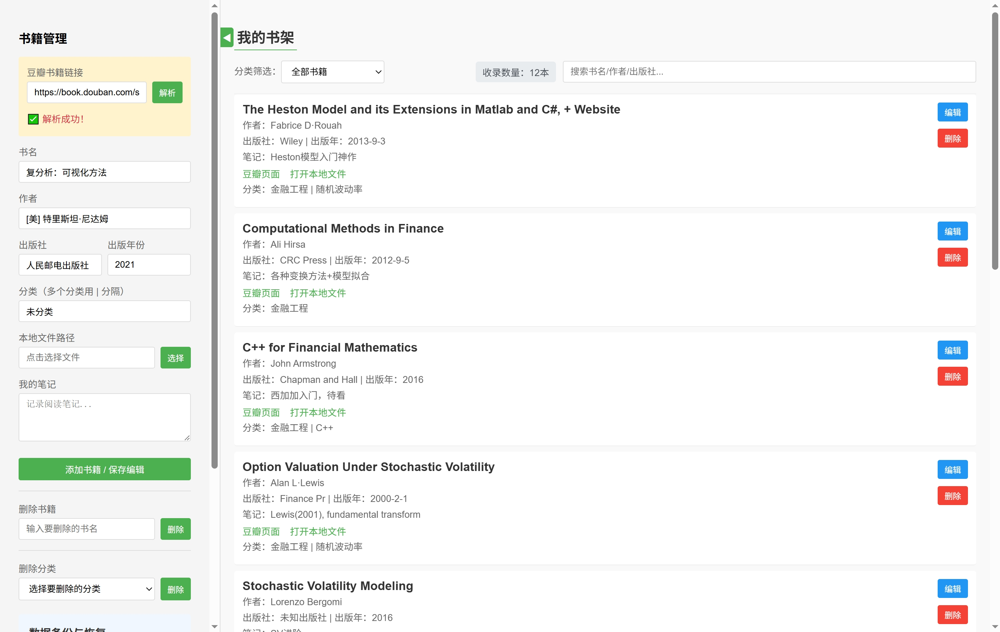

# 我的书架 - 个人图书管理工具

## 简介

还在寻找一款**轻量级的本地PDF图书管理工具**吗？你是否厌倦了整理、寻找PDF图书的繁琐，又不想每次都打开Zotero、Calibre等管理软件？那就来看看"我的书架"这个项目吧。
"我的书架"是一个基于浏览器的个人图书管理工具，帮助您轻松整理、分类和查找您的书籍收藏。所有数据都保存在本地浏览器存储中，无需服务器，完全离线使用。

## 主要功能

### 📚 书籍管理
- 添加/编辑/删除书籍信息
- 记录书名、作者、出版社、出版年份等基本信息
- 添加个人阅读笔记、评论
- 记录本地文件路径，快速打开电子书

### 🏷️ 分类系统
- 支持多分类标签（用"|"分隔）
- 按分类筛选书籍
- 管理分类标签（支持删除某一分类下的全部书籍）

### 🔍 搜索功能
- 快速搜索书名、作者或出版社
- 实时筛选结果

### 🌐 豆瓣集成
- 通过豆瓣书籍链接自动获取书籍信息，自动解析书名、作者、出版社和分类

### 📂 数据备份
- 导出所有书籍数据为JSON文件
- 从JSON文件导入数据
- 完全本地存储，保护隐私

## 使用方法

1. 直接打开`HTMLMyShelf.html`文件即可使用（建议使用Edge/Chrome/Firefox等现代浏览器），**完全基于前端HTML/CSS/JS轻量级实现**。
2. **添加书籍**：
   - 豆瓣标准化书籍：通过豆瓣书籍页链接自动获取，例如https://book.douban.com/subject/26708119/
   - 自定义PDF文件：对于某些非标准化的PDF文档，也可以通过手动输入相关信息来管理。
3. 使用分类和搜索功能快速查找书籍，支持搜索书名、作者、出版社。
4. 定期导出数据备份（json格式）

## 注意事项

- 由于浏览器安全限制，目前本地文件路径仅支持传入文件名，需要手动确认（输入文件所在目录的绝对路径）。
- 数据存储基于浏览器的localStorage，因此不直接支持跨浏览器和设备。但支持导出和导入图书列表。建议定期导出数据备份。
- 豆瓣解析功能可能受豆瓣反爬机制、网络环境的影响，失败时建议再次尝试。

## 未来计划

- [ ] 支持更多书籍元数据（ISBN、封面等）
- [ ] 增加数据统计和可视化

## 关于

**由PhilZhu开发于2025年4月**

**知乎链接:** 有没有PDF管理软件？并不是zotero、endnote等文献管理软件，而是纯粹的PDF管理软件？ - Little Flyer的回答 - 知乎
https://www.zhihu.com/question/276393636/answer/1901238995997942961

欢迎提出改进建议和功能需求！喜欢就点个Star吧~~~
